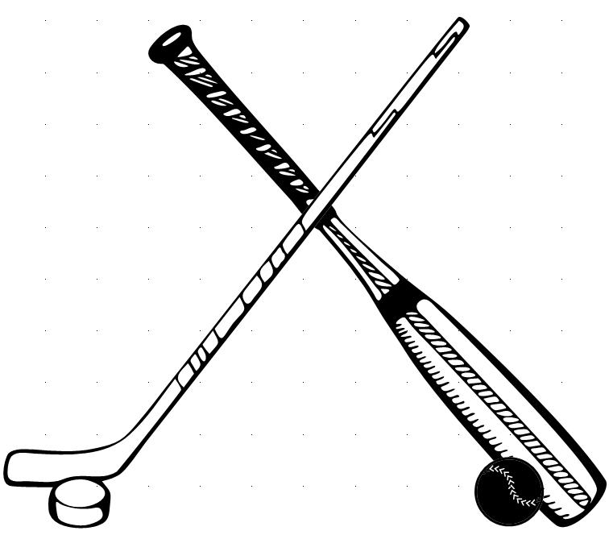

Logistic Regression
=

Overview
--------

In this homework you'll implement a stochastic gradient ascent for
logistic regression and you'll apply it to the task of determining
whether documents are talking about hockey or baseball.

